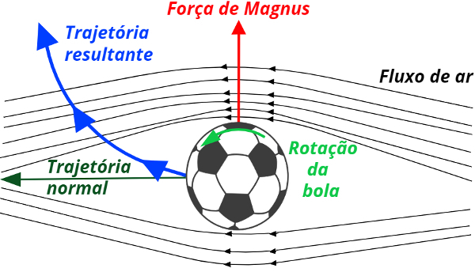
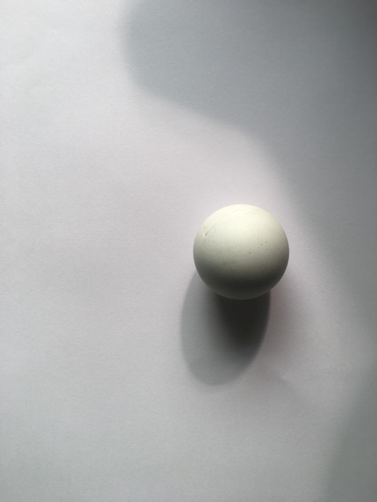

# Efeito Magnus:
## 1. Início
### Integrantes:  
  * Bruno Giuliani Gomes (esh2900) - 17/0030610  
  * Gabriel de Andrade Ribeiro (gabrielaribeiro) - 17/0103366  
  * Giovanna Bezerra Oliveira Altoé (giovannaaltoe) - 17/0104133 
  
### Tema: Efeito Magnus - esporte  

### Objetivo: 
   * Estudar e demonstrar o efeito magnus nas bolas usadas em diferentes esportes por meio de testes com fluidos e observar suas variações de acordo com cada tipo de material, tamanho e peso.

### Requisitos de solução:
   * Observar o efeito magnus gerado em uma bola.
   * Observar a variação quando comparada com o movimento normal da bola.
   
### Escopo do experimento:
   * Passo 1: Buscar referências bibliográficas sobre o assunto com o intuito de coletar possíveis soluções para o problema, além de melhores alternativas para executá-lo.
   * Passo 2: Procurar locais adequados e os materiais necessários para a realização do experimento.
   * Passo 3: Realizar o experimento, por meio de vídeos e fotos com o objetivo de demonstrar o efeito.
   
### Avaliação de viabilidade:
   * A proposta do grupo se torna viável partindo do ponto de vista que o objetivo é demonstrar as consequências que a bola sofre com o efeito magnus, possuindo durante os testes uma câmera e um espaço adequado, o efeito magnus torna-se possível de demonstração e observação.

## 2. Planejamento e Preparação
### Tempo estimado:
   * Passo 1: 2 semanas;
   * Passo 2: 1 semana;
   * Passo 3: 3 semanas.  
   
### Divisão de tarefas:
   * Etapa de pesquisas e busca de dados: Bruno, Gabriel e Giovanna.
   * Busca dos meios para a execução: Bruno, Gabriel e Giovanna.
   * Experimento:
   
       | Testes com as bolas | Fotos | Vídeos e edição |
       | :-----------------: | :---: | :-------------: |
       | Gabriel | Giovanna | Bruno |
       
       
### Cronograma estimado:
   * Passo 1: 2 semanas: 09/09 a 20/09;
   * Passo 2: 1 semana: 23/09 a 27/09;
   * Passo 3: 3 semanas: 30/09 a 18/10.  

### Dados a serem medidos ou calculados:
Como o intuito do experimento não é uma demonstração numérica do efeito,
e sim uma visualização de sua existência, os dados que levantaremos serão 
as imagens e os vídeos de chutes e arremessos das bolas que serão usadas para executar 
o experimento.

### Resultados Esperados:
O resultado que o experimento visa alcançar é comprovar 
por meio de filmagens a influência do efeito Magnus dentro
de alguns esportes com bola, ao tornar evidente a curva de bolas em rotação
feitas de diferentes materiais e tamanhos.

### Divisão de tarefas:
A divisão será feita, assim como descrita na etapa 2:   
       * Testes com as bolas: Gabriel;  
       * Fotos: Giovanna;  
       * Vídeo e edição: Bruno.  
       
## 3. Execução      
### Fotos do experimento:
As fotos serão apenas dos utensílios que iremos utilizar e do local a ser realizado o experimento:

<nobr>
<nobr>
<nobr>

### Dados medidos:

#### Dados Gerais do Experimento (Especificação do Fabricante):

Campo society: 30x16 m;  
Gol: 2,5x3 m; 

Bola de futebol:
 * 70 cm de circunferência;  
 * 450 g;  
 
Bola de tênis:
 * 21,5 cm de diâmetro;  
 * 54 g;  
 
Bola de ping pong:
 * 40 mm de diâmetro;  
 * 2,74 g;  
 
Mesa de ping pong:  
 * 152 cm de largura;  
 * 274 cm de comprimento;  
 
## 4. Análise e conclusão:

#### Teste 1 -> Futebol

Uma bola de futebol foi chutada do meio do campo de uma quadra de futebol, assim obtivemos os seguintes resultados medidos:

Distância entre o ponto do chute e o gol (S) ~ metade do campo, logo:
S = 15 m

| Chute | Rotações | Tempo(s) |  Vel. Angular(rad/s)| Velocidade linear da suprefície da Bola(m/s)  |
|:-----:|:--------:|:--------:|:-----------------:|:-------------------------:|
| 1     |     22   |   3      |      46.05          |           5.06          |
| 2     |     25   |   3      |      52.13          |           5.81          |
| 3     |     18   |   4      |      28.25          |           3.15          |

#### Teste 2 -> Tênis

A bola de tênis foi arremesada do 7 andar, girando e sem girar, para medirmos a diferença no ponto de queda.

Altura média de 7 andares, h=19,6 m

|  Estado | Tempo de Queda(s) |Distancia da origem ao atingir o chão(cm) |
|:-------:|:-----------------:|:-------------------------------------:|
| Parada  |     2,5 ± 0,4     |               90                       |
| Rodando |     2,9 ± 0,6     |               150                      |

#### Teste 3 -> Ping Pong

Para a Bola de Ping Pong não foram realizados cálculos, apenas tentamos visualizar o movimento.

#### Vídeos dos Experimentos:  
 
https://www.youtube.com/watch?v=N0Bj7yqRiR0&feature=youtu.be

https://www.youtube.com/watch?v=YMj7vLnP2Xo&feature=youtu.be

https://www.youtube.com/watch?v=tZouo-QaRBc&feature=youtu.be

## 5. Teoria utilizada

* Trata-se de um fenômeno hidrodinâmico descoberto pelo
químico e físico alemão Heinrich Gustav Magnus pelo qual a trajetória em um fluido (líquido
ou gás) de um objeto é alterada devido à sua rotação.
* Quando a bola de futebol gira em torno de seu centro de sustentação
perpendicular a velocidade e ao eixo de rotação é chamada de força Magnus.
* Uma bola de futebol em movimento no ar está sujeita a
forças aerodinâmicas causadas pela pressão e viscosidade do meio. A força resultante pode ser decomposta
em duas componentes: o arrasto, antiparalelo à velocidade, e a sustentação, perpendicular à velocidade.

#### A força de arrasto é definida pela equação:

   
  * ρ é a densidade do ar;
  * A é a área da seção transversal da bola;
  * Ca é o coeficiente de arrasto, sendo uma grandeza admensional;
* Para uma bola com velocidade muito menor que a do som, a única quantidade deste tipo é o número de Reynolds;

   * D é o diâmetro da bola;
   * η é a viscosidade do ar;
* O número de Reynolds mede a razão entre as forças inerciais que atuam na bola; 
* Para pequenos números de Reynolds, Re<<1, o
coeficiente de arrasto é dado pela fórmula de Stokes:
  
  
#### Crise do arrasto e a camada limite

 A crise do arrasto está diretamente associada ao comportamento da “camada limite” de ar que se forma
em torno da bola. A camada limite tem origem na
aderência das moléculas do ar á superfície da bola. A
viscosidade transmite parcialmente esta aderência às
moléculas mais distantes, formando uma região que
tende a mover-se com a bola. Esta região é a camada
limite, ou camada de Prandtl.
A crise do arrasto ocorre quando a camada limite torna-se turbulenta. A turbulência permite que a
camada resista melhor à tendência de separação,
e com isso o ponto de descolamento move-se mais
para trás da esfera, diminuindo a área da esteira.
A textura da superfície também afeta o escoamento
da camada limite. Uma esfera rugosa irá sofrer a crise
em um número de Reynolds inferior ao de uma esfera
lisa. A rugosidade precipita a turbulência na camada
limite e, consequentemente, diminui a resistência do
ar a altas velocidades.

#### O efeito Magnus 

Quando a bola de futebol gira em torno de seu centro de sustentação
perpendicular à velocidade e ao eixo de rotação é chamada de força Magnus.   
Dada pela fórmula :

O coeficiente de sustentação Cs desempenha um papel semelhante ao coeficiente de arrasto.   
O coeficiente de Magnus é definido por: 

Assim a equação ficará:

Para o caso com bolas de futebol, o ângulo será ζ=π/2 para indicar Cm aproximadamente igual a 1.

 

## 6. Conclusão com base na teoria:

De acordo com os estudos teóricos e o experimento realizado na prática, o grupo pôde sintetizar que o Efeito Magnus foi observado parcialmente tendo em vista que ocorreram erros experimentais, tais como, superfície material da bola, medição do tempo e linearidade do campo. Além disso, o fator que impossibilitou a realização total do efeito foram as condições climáticas nos dias das gravações da prática.   
Contudo, conforme os vídeos apresentados, é notável a visualização do Efeito sobre as condições estabelecidas. Conclui-se que conseguimos demonstrar o Efeito Magnus com três tipos de bolas diferentes. 

### Referências

* https://aprender.ead.unb.br/pluginfile.php/166074/mod_resource/content/10/dinflu.pdf  
* http://www.scielo.br/scielo.php?script=sci_arttext&pid=S1806-11172004000400003  
* http://eurekabrasil.com/ciencia-por-tras-do-gol-de-cr7/  
* Arlete Moreira dos Santos|"Física nos jogos de futebol"-Universidade Estadual de Maringá - Centro de Ciências Exatas - Departamento de Física - 2012|
* Revista Brasileira de Ensino de Física, v. 26, n. 4, p. 297 - 306, (2004)|"A aerodinâmica da bola de futebol" - C.E. Aguiar e G. Rubini|    
